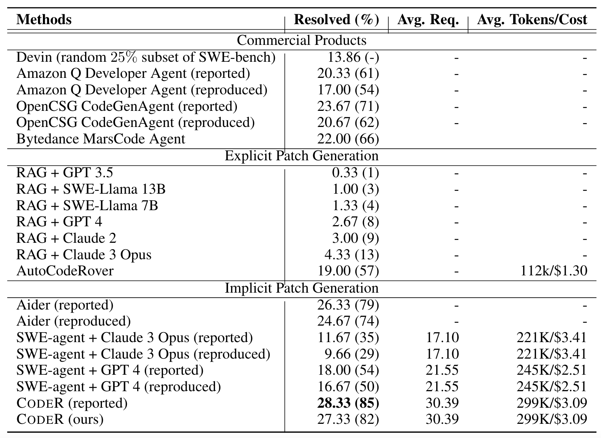

<p align="center">
  <a href="https://github.com/NL2Code/CodeR">
    
  </a>
</p>

## 📰 News
* **[Jun. 4, 2024]**: 🎉 We release CodeR, which can solve $28$% of issues on [SWE-bench lite](https://www.swebench.com) in the case of submitting only once per issue, Read more in our [paper](https://arxiv.org/pdf/2406.01304).

## 🌏 Abstract
GitHub issue resolving recently has attracted significant attention from academia and industry. SWE-bench is proposed to measure the performance in resolving issues. In this paper, we propose CodeR, which adopts a multi-agent framework and pre-defined task graphs to Repair & Resolve reported bugs and add new features within code Repository. On SWE-bench lite, CodeR is able to solve $28.00$% of issues, in the case of submitting only once for each issue. We examine the performance impact of each design of CodeR and offer insights to advance this research direction.


## 🧪 Results on SWE-agent lite


## 📗 Citation
```
@misc{chen2024coder,
      title={CodeR: Issue Resolving with Multi-Agent and Task Graphs}, 
      author={Dong Chen and Shaoxin Lin and Muhan Zeng and Daoguang Zan and Jian-Gang Wang and Anton Cheshkov and Jun Sun and Hao Yu and Guoliang Dong and Artem Aliev and Jie Wang and Xiao Cheng and Guangtai Liang and Yuchi Ma and Pan Bian and Tao Xie and Qianxiang Wang},
      year={2024},
      eprint={2406.01304},
      archivePrefix={arXiv},
      primaryClass={cs.CL}
}
```

## ❣️ Question

Please feel free to [arise issues](https://github.com/NL2Code/CodeR/issues/new) If you have any quesions.